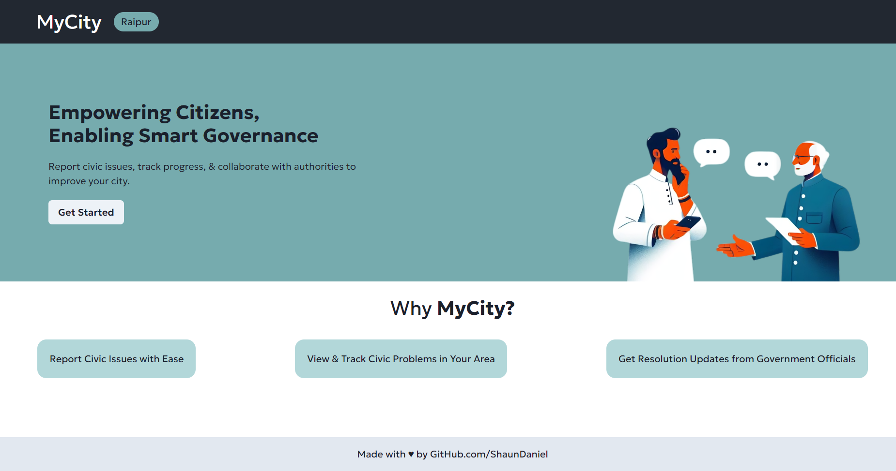

# MyCityApp

MyCityApp is a web application that empowers citizens to report civic issues in their local communities and facilitates efficient communication between citizens and government authorities for timely resolution.

## Features

- **Citizen Reporting**
  - Report new issues with location, description, and multimedia (images/videos)
  - View a list of reported issues with filters, search, and map view
  - Receive notifications on status updates for reported issues

- **Official Management**
  - View a list of reported issues with filters, search, and map view
  - Comment on reported issues and provide status updates
  - Mark issues as resolved with images/videos of completed work

- **Admin Panel**
  - User management (create, edit, delete user accounts)
  - Content moderation (review and approve/reject reported issues)
  - Generate reports and analytics

## Technologies Used

- **Frontend**: React.js,Axios
- **Backend**: Node.js, Express.js
- **Database**: MongoDB
- **Authentication**: Passport.js
- **Deployment**:

## Screenshots



## Getting Started

### Prerequisites

- Node.js (v14 or higher)
- npm (Node Package Manager)

### Installation

1. Clone the repository:
   ```
   git clone https://github.com/shaundaniel/mycity
   ```

2. Navigate to the project directory:
   ```
   cd mycity-app
   ```

3. Install backend dependencies:
   ```
   cd backend
   npm install
   ```

4. Install frontend dependencies:
   ```
   cd ../frontend
   npm install
   ```

5. Create a `.env` file in the `backend` directory and add your MongoDB connection string.

### Running the Application

1. Start the backend server:
   ```
   cd backend
   nodemon ./src/app.js
   ```

2. In a separate terminal, start the frontend development server:
   ```
   cd frontend
   npm start
   ```

3. The application should now be accessible at `http://localhost:3000`.

## Contributing

Contributions are welcome! If you find any issues or want to add new features, please open an issue or submit a pull request.

## License

This project is licensed under the [MIT License](LICENSE).
```
This README provides an overview of the project, including its features, technologies used, instructions for getting started (installation and running the application), contributing guidelines, and licensing information.

Feel free to customize and expand this README as needed, adding sections for project structure, deployment instructions, coding guidelines, or any other relevant information for your project.
